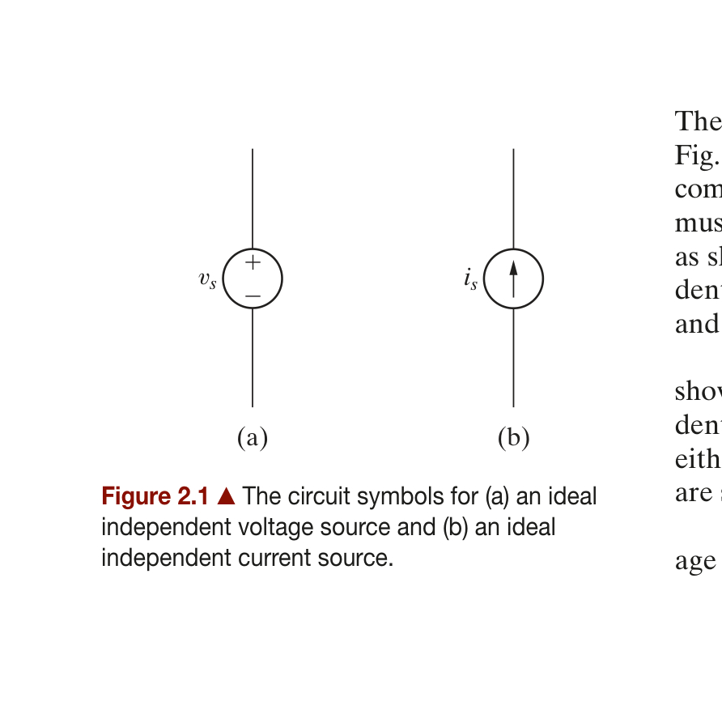
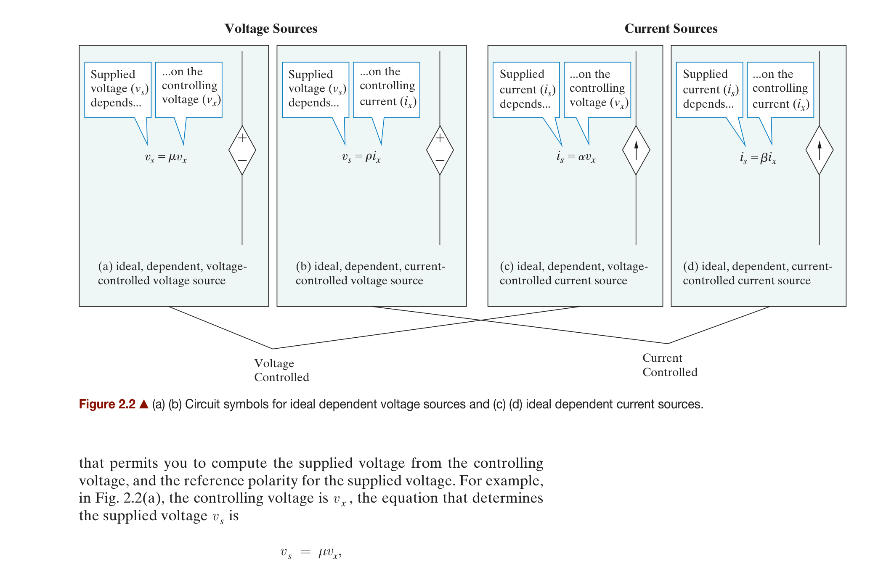
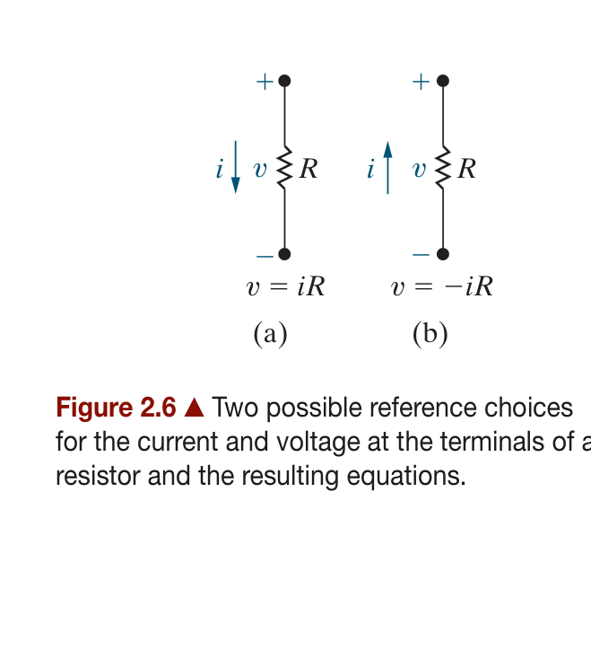
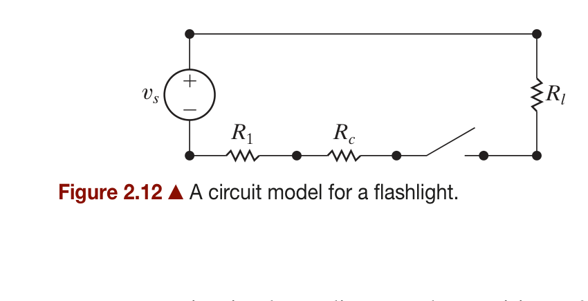
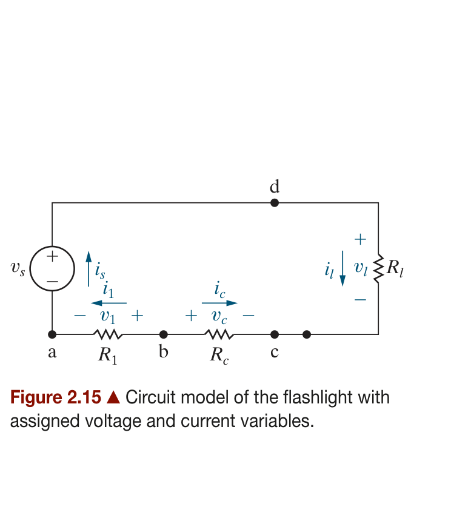
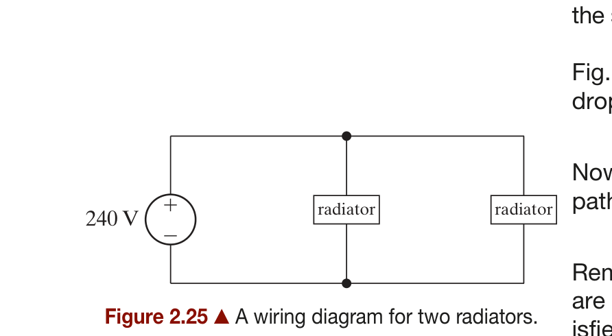
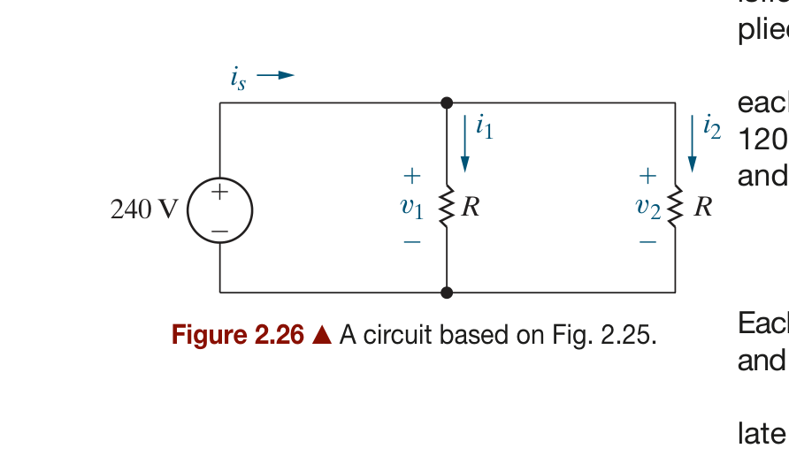
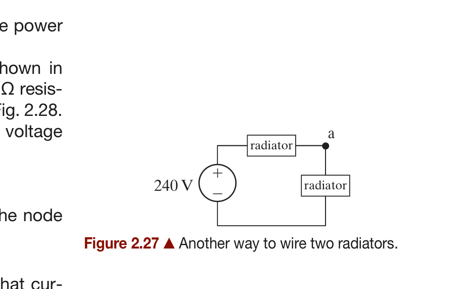
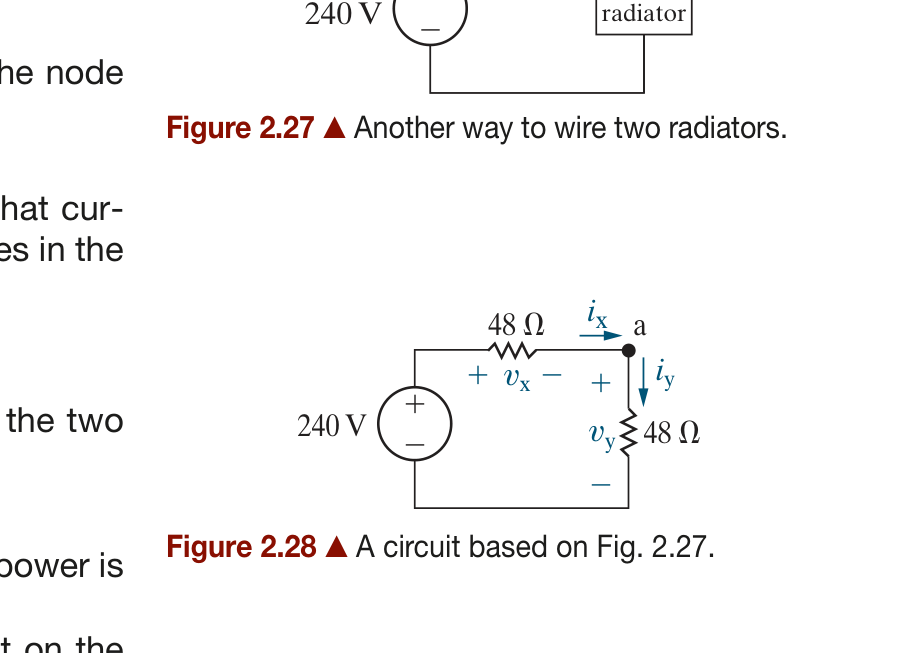

# Chapter 2: Circuit Elements — Summary

*Source: Electric Circuits, 12th Edition (James Nilsson, Susan Riedel)*

---

## Chapter Objectives

1. Understand the symbols for and the behavior of the following ideal basic circuit elements: independent voltage and current sources, dependent voltage and current sources, and resistors.
2. Be able to state Ohm's law, Kirchhoff's current law, and Kirchhoff's voltage law, and be able to use these laws to analyze simple circuits.
3. Know how to calculate the power for each element in a simple circuit and be able to determine whether or not the power balances for the whole circuit.

---

## Table of Contents

- [2.1 Voltage and Current Sources](#21-voltage-and-current-sources)
  - [Figure 2.1 — Ideal Independent Sources](#figure-21--circuit-symbols-for-ideal-independent-sources)
  - [Figure 2.2 — Ideal Dependent Sources](#figure-22--circuit-symbols-for-ideal-dependent-sources)
- [2.2 Electrical Resistance (Ohm's Law)](#22-electrical-resistance-ohms-law)
  - [Figure 2.6 — Ohm's Law Configurations](#figure-26--ohms-law-two-reference-configurations)
- [2.3 Constructing a Circuit Model](#23-constructing-a-circuit-model)
  - [Figure 2.12 — Flashlight Circuit Model](#figure-212--a-circuit-model-for-a-flashlight)
  - [Figure 2.15 — Flashlight Circuit Model with Assigned Variables](#figure-215--circuit-model-of-the-flashlight-with-assigned-variables)
- [2.4 Kirchhoff's Laws](#24-kirchhoffs-laws)
- [2.5 Analyzing a Circuit Containing Dependent Sources](#25-analyzing-a-circuit-containing-dependent-sources)
- [Practical Perspective: Heating with Electric Radiators](#practical-perspective-heating-with-electric-radiators)
  - [Figure 2.25 — Parallel Wiring Diagram](#figure-225--a-wiring-diagram-for-two-radiators)
  - [Figure 2.26 — Parallel Circuit Model](#figure-226--a-circuit-based-on-fig-225)
  - [Figure 2.27 — Series Wiring Diagram](#figure-227--another-way-to-wire-two-radiators)
  - [Figure 2.28 — Series Circuit Model](#figure-228--a-circuit-based-on-fig-227)
- [Summary of Key Equations](#summary-of-key-equations)

---

## 2.1 Voltage and Current Sources

### Introduction

An **electrical source** is a device capable of converting nonelectric energy to electric energy and vice versa. Examples include:
- **Battery**: converts chemical energy ↔ electric energy
- **Dynamo (generator/motor)**: converts mechanical energy ↔ electric energy

Because electric sources either deliver or absorb electric power while maintaining either voltage or current, we define two ideal basic circuit elements.

### Ideal Independent Voltage Source

> An **ideal voltage source** is a circuit element that maintains a **prescribed voltage across its terminals regardless of the current** flowing in those terminals.

Key properties:
- The voltage is specified by the source value alone
- The current through the voltage source is determined by the external circuit, **not** by the source itself
- It is impossible to specify the current in an ideal voltage source as a function of its voltage

### Ideal Independent Current Source

> An **ideal current source** is a circuit element that maintains a **prescribed current through its terminals regardless of the voltage** across those terminals.

Key properties:
- The current is specified by the source value alone
- The voltage across the current source is determined by the external circuit, **not** by the source itself
- It is impossible to determine the voltage across an ideal current source from only its current

*(a) Circle with +/− inside represents an ideal independent voltage source. (b) Circle with an arrow inside represents an ideal independent current source.*

### Independent vs. Dependent Sources

| Type | Description |
|------|-------------|
| **Independent source** | Establishes a voltage or current **without relying** on any other voltage or current in the circuit. Its value is specified by the source alone. |
| **Dependent (controlled) source** | Establishes a voltage or current **whose value depends on** a voltage or current elsewhere in the circuit. |

### Ideal Dependent Sources

Dependent sources have a **controlling variable** (a voltage or current elsewhere in the circuit) and a **supplied quantity** that is proportional to that controlling variable. There are four types:

| Type | Symbol | Controlling Variable | Equation | Units of Constant |
|------|--------|---------------------|----------|-------------------|
| Voltage-controlled voltage source (VCVS) | Diamond with +/− | Voltage $v_x$ | $v_s = \mu v_x$ | $\mu$: dimensionless |
| Current-controlled voltage source (CCVS) | Diamond with +/− | Current $i_x$ | $v_s = \rho i_x$ | $\rho$: V/A (ohms) |
| Voltage-controlled current source (VCCS) | Diamond with arrow | Voltage $v_x$ | $i_s = \alpha v_x$ | $\alpha$: A/V (siemens) |
| Current-controlled current source (CCCS) | Diamond with arrow | Current $i_x$ | $i_s = \beta i_x$ | $\beta$: dimensionless |

*The four types of ideal dependent (controlled) sources. (a)(b) produce a voltage output; (c)(d) produce a current output. The diamond shape distinguishes dependent sources from independent sources.*

### DC Sources

Constant sources are often called **dc sources**. The term "dc" originally stood for "direct current" but now universally means **constant** voltage or current. Ideal sources generate voltages or currents that are invariant with time.

### Active vs. Passive Elements

| Classification | Description | Examples |
|---------------|-------------|----------|
| **Active elements** | Model devices capable of **generating** electric energy | Ideal voltage sources, ideal current sources, dependent sources |
| **Passive elements** | Model devices that **cannot generate** electric energy | Resistors, inductors, capacitors |

### Interconnection Constraints for Ideal Sources

The ideal nature of sources imposes constraints on how they can be interconnected:

**Valid interconnections:**
- Two ideal voltage sources **in parallel** must have the **same voltage** and same polarity
- Two ideal current sources **in series** must have the **same current** and same direction
- An ideal voltage source and an ideal current source can always be connected in parallel
- An ideal voltage source and an ideal current source can always be connected in series

**Invalid interconnections:**
- Two ideal voltage sources with **different voltages** in parallel
- Two ideal current sources with **different currents** in series

---

## 2.2 Electrical Resistance (Ohm's Law)

### Resistance and the Resistor

**Resistance** is the capacity of materials to impede the flow of electric current. The circuit element that models this behavior is the **resistor**.

- When electrons move through a material, they interact with the atomic structure, converting some electric energy to **thermal energy** (heat)
- Metals like copper and aluminum have small resistance values → used as wires
- A resistor is an **ideal basic circuit element** described mathematically by its voltage-current relationship

### Ohm's Law

For a resistor, the relationship between voltage and current is known as **Ohm's law**:

$$
\boxed{v = iR}
$$

Where:
- $v$ = voltage across the resistor in **volts (V)**
- $i$ = current through the resistor in **amperes (A)**
- $R$ = resistance in **ohms (Ω)**

The sign convention matters:

*(a) When current flows in the direction of the voltage drop: $v = iR$. (b) When current flows in the direction of the voltage rise: $v = -iR$. Both follow from the passive sign convention.*

Alternatively:

$$
i = \frac{v}{R} = Gv
$$

### Conductance

The **reciprocal of resistance** is called **conductance**, symbolized by $G$:

$$
\boxed{G = \frac{1}{R}}
$$

Conductance is measured in **siemens (S)**. An 8 Ω resistor has a conductance of 0.125 S.

### Power in a Resistor

Resistors **always absorb power** (dissipate as heat). Multiple formulas for resistor power:

$$
\boxed{p = vi = i^2 R = \frac{v^2}{R} = \frac{i^2}{G} = v^2 G}
$$

Since power in a resistor is always positive, resistors are **passive elements** that absorb energy from the circuit.

### Short Circuit and Open Circuit

| Condition | Resistance | Behavior | Symbol |
|-----------|-----------|----------|--------|
| **Short circuit** | $R = 0$ | Zero voltage drop for any current | Straight wire |
| **Open circuit** | $R = \infty$ | Zero current for any voltage | Break in wire |

---

## 2.3 Constructing a Circuit Model

### Modeling Guidelines

Developing a circuit model is an important engineering skill. The flashlight example illustrates key modeling principles:

1. **Focus on electrical behavior** — Different physical components with similar electrical behavior are represented by the same circuit element. In the flashlight, the lamp, coiled connector, and metal case are all modeled as resistors.

2. **Account for undesired effects** — Models must include both desired and parasitic effects. The lamp's resistance produces light (desired), while the case and coil resistance produce only heat (parasitic/undesired).

3. **Modeling requires approximation** — Simplifying assumptions are made: ideal switch, negligible contact resistance, ideal voltage source for batteries, etc.

### Flashlight Circuit Model

The flashlight demonstrates how to build a circuit model from a physical system:

| Physical Component | Circuit Model | Role |
|-------------------|---------------|------|
| Dry-cell batteries | Ideal voltage source $v_s$ | Power source |
| Lamp filament | Resistor $R_l$ | Produces light and heat |
| Metal connector/spring | Resistor $R_1$ | Conducts current; mechanical pressure |
| Metal case | Resistor $R_c$ | Completes circuit; mechanical support |
| Switch | Short circuit ($R=0$) or open circuit ($R=\infty$) | Controls on/off state |

*A circuit model for a flashlight showing the voltage source $v_s$, connector resistance $R_1$, lamp resistance $R_l$, case resistance $R_c$, and the switch. The model represents the essential electrical behavior of the physical flashlight.*

*Circuit model of the flashlight with assigned voltage and current variables: $v_s$, $i_s$, $R_1$, $v_1$, $i_1$, $R_c$, $v_c$, $i_c$, $R_l$, $v_l$, $i_l$. Nodes a, b, c, and d are labeled for applying Kirchhoff's laws and Ohm's law.*

### Terminal Characteristics Modeling

When only terminal behavior is known (not internal components):
1. Measure voltage $v_t$ and current $i_t$ at the terminals
2. Plot $v_t$ vs. $i_t$
3. Determine the equation of the resulting line
4. Construct a circuit model whose terminal equation matches:
   - If $v_t = mi_t$ → a resistor of value $m$ Ω
   - If $v_t = V_0 - mi_t$ → a voltage source $V_0$ in series with a resistor $m$

---

## 2.4 Kirchhoff's Laws

### Circuit Terminology

| Term | Definition |
|------|------------|
| **Node** | A point where two or more circuit elements meet |
| **Terminal** | The start or end point of an individual circuit element |
| **Series elements** | Two elements connected at a single node with no other elements at that node |
| **Closed path (loop)** | A path traced through connected elements, starting and ending at the same node, without passing through any intermediate node more than once |

### Kirchhoff's Current Law (KCL)

> **KCL:** The algebraic sum of all the currents at any node in a circuit equals zero.

$$
\boxed{\sum_{\text{node}} i = 0}
$$

Sign convention: Assign a positive sign to currents **leaving** the node (negative for currents entering), or vice versa — be consistent.

**Key implications:**
- KCL is a statement of **conservation of charge**
- In a circuit with $n$ nodes, only $n - 1$ independent KCL equations can be written
- If two elements are in series, they carry the **same current**

### Kirchhoff's Voltage Law (KVL)

> **KVL:** The algebraic sum of all the voltages around any closed path in a circuit equals zero.

$$
\boxed{\sum_{\text{loop}} v = 0}
$$

Sign convention: Assign a positive sign to voltage **drops** in the tracing direction (negative for rises), or vice versa — be consistent.

**Key implications:**
- KVL is a statement of **conservation of energy**
- KVL applies to **any** closed path in a circuit
- When tracing a loop, a voltage appears either as a rise or a drop

### Solving Circuits with Kirchhoff's Laws and Ohm's Law

**Strategy for solving a circuit:**

1. **Label all unknown voltages and currents** with reference polarities/directions
2. **Count the unknowns** — you need that many independent equations
3. **Apply Ohm's law** to each resistor (relates resistor voltage and current)
4. **Apply KCL** at independent nodes ($n - 1$ equations for $n$ nodes)
5. **Apply KVL** around independent loops to get remaining equations
6. **Solve the system** of simultaneous equations
7. **Verify** using power balance ($\sum p = 0$)

**Analysis tips:**
- If you know the current in a resistor, you know its voltage (via Ohm's law), and vice versa — associate **one unknown** per resistor
- When two elements are in series, they share one current — define only **one unknown current**
- Choose analysis tools strategically to minimize the number of equations

---

## 2.5 Analyzing a Circuit Containing Dependent Sources

### Strategy

Circuits with dependent sources require the same tools (KCL, KVL, Ohm's law), but with additional care:

1. **Identify the controlling variable** ($v_x$ or $i_x$) — the voltage or current that determines the dependent source's output
2. **Express the dependent source value** in terms of the controlling variable
3. **Count additional unknowns** — the controlling variable may be an additional unknown
4. **Write constraint equations** relating the controlling variable to other circuit variables
5. **Write KCL and KVL equations** as usual, incorporating the dependent source relationships

### Key Observations

- Not every closed path yields a useful KVL equation (e.g., paths containing dependent current sources where the voltage is unknown)
- Not every node yields a useful KCL equation
- **Think about a strategy** before writing equations — choose fruitful paths and nodes to minimize equations
- The same fundamental approach works for all circuits: independent sources + dependent sources + resistors + Kirchhoff's laws + Ohm's law

---

## Practical Perspective: Heating with Electric Radiators

### Problem Context

Two electric radiators (1200 W, 240 V each) can be wired to a 240 V source in two different configurations. We want to determine which wiring provides sufficient heat.

### Wiring Configuration 1: Parallel (Figs. 2.25–2.26)

The radiators are connected in **parallel** across the 240 V source:

*Figure 2.25: A wiring diagram showing two radiators connected in parallel across a 240 V source.*

The circuit model replaces each radiator with its equivalent resistance $R$ = 48 Ω:

- Each radiator has voltage $v_1 = v_2 = 240$ V (satisfies the voltage rating)
- Resistance of each radiator: $R = \frac{V^2}{P} = \frac{240^2}{1200} = 48$ Ω
- Current in each radiator: $i = \frac{240}{48} = 5$ A
- Power per radiator: $P = \frac{240^2}{48} = 1200$ W
- **Total power: 2400 W** ✓ (sufficient to heat the garage)

*Figure 2.26: Circuit model of the parallel wiring. Each 48 Ω radiator is connected directly across the 240 V source. Currents $i_1$ and $i_2$ flow through each branch, with $i_s = i_1 + i_2$ = 10 A.*

### Wiring Configuration 2: Series (Figs. 2.27–2.28)

The radiators are connected in **series** across the 240 V source:

*Figure 2.27: A wiring diagram showing two radiators connected in series across a 240 V source. Node a is the junction between the two radiators.*

The circuit model with assigned variables:

- Total resistance: $R_{total} = 48 + 48 = 96$ Ω
- Circuit current: $i = \frac{240}{96} = 2.5$ A
- Power per radiator: $P = i^2 R = (2.5)^2 \times 48 = 300$ W
- **Total power: 600 W** ✗ (insufficient to heat the garage)

*Figure 2.28: Circuit model of the series wiring. The two 48 Ω resistors share the 240 V source. KVL around the loop gives $v_x + v_y = 240$ V, and KCL at node a gives $i_x = i_y = i$.*

### Conclusion

The way radiators are wired has a dramatic impact on power output:
- **Parallel wiring**: Each radiator gets the full 240 V → 1200 W each → 2400 W total
- **Series wiring**: The 240 V is divided between the radiators → 300 W each → 600 W total

> **Always verify power balance:** $\sum p = 0$ confirms the analysis is correct.

---

## Summary of Key Equations

| Equation | Description |
|----------|-------------|
| $v = iR$ | Ohm's law (current in direction of voltage drop) |
| $v = -iR$ | Ohm's law (current in direction of voltage rise) |
| $i = \dfrac{v}{R} = Gv$ | Ohm's law solved for current |
| $G = \dfrac{1}{R}$ | Conductance definition |
| $p = vi = i^2 R = \dfrac{v^2}{R}$ | Power absorbed by a resistor |
| $\displaystyle\sum_{\text{node}} i = 0$ | Kirchhoff's Current Law (KCL) |
| $\displaystyle\sum_{\text{loop}} v = 0$ | Kirchhoff's Voltage Law (KVL) |
| $v_s = \mu v_x$ | VCVS (voltage-controlled voltage source) |
| $v_s = \rho i_x$ | CCVS (current-controlled voltage source) |
| $i_s = \alpha v_x$ | VCCS (voltage-controlled current source) |
| $i_s = \beta i_x$ | CCCS (current-controlled current source) |

---

## Key Terms

| Term | Definition |
|------|-----------|
| **Ideal voltage source** | Maintains prescribed voltage regardless of current |
| **Ideal current source** | Maintains prescribed current regardless of voltage |
| **Independent source** | Source value established independently of other circuit variables |
| **Dependent (controlled) source** | Source value depends on a voltage or current elsewhere in the circuit |
| **DC source** | Constant voltage or current source |
| **Active element** | Models a device capable of generating electric energy |
| **Passive element** | Models a device that cannot generate electric energy |
| **Resistance ($R$)** | Capacity of a material to impede current flow (unit: ohm, Ω) |
| **Conductance ($G$)** | Reciprocal of resistance (unit: siemens, S) |
| **Resistor** | Ideal circuit element that obeys Ohm's law |
| **Short circuit** | Zero-resistance path ($R = 0$) |
| **Open circuit** | Infinite-resistance path ($R = \infty$, no current) |
| **Node** | Point where two or more circuit elements meet |
| **Series** | Elements connected at a node with no other elements at that node |
| **Closed path (loop)** | Path through elements starting and ending at same node |
| **KCL** | Algebraic sum of currents at any node equals zero |
| **KVL** | Algebraic sum of voltages around any closed path equals zero |

---

## Problem-Solving Tips

1. **Always label reference directions** for voltages and currents before writing equations.
2. **Use the passive sign convention** consistently — current entering the positive terminal means $p = +vi$.
3. **Count unknowns first** — you need exactly that many independent equations.
4. **Apply Ohm's law** to resistors first — this directly relates voltage and current.
5. **Use KCL at nodes** — remember only $n - 1$ independent equations from $n$ nodes.
6. **Use KVL around loops** — choose loops that don't contain dependent current sources (unknown voltage).
7. **For dependent sources**: identify the controlling variable and write the constraint equation early.
8. **Verify with power balance** — $\sum p = 0$ is a powerful check on your solution.
9. **Think strategically** — not every node or loop yields useful information; plan your approach.
10. **Series elements share the same current**; use this to reduce the number of unknowns.
